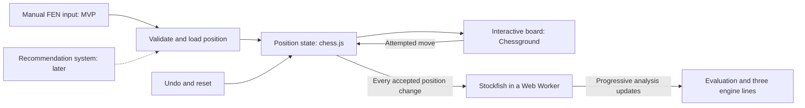

# Chess Analyzer — Application Specification

Status: MVP scope defined; ready for implementation
Date: 2026-09-28

## Purpose

Build a frontend for exploring chess positions. A recommendation system will
supply a position, and the user will interact with the board and move pieces.
Stockfish analyzes the position automatically, showing an evaluation and three
engine continuations that update as it searches deeper. Moving, undoing, resetting,
or loading another position automatically refreshes the analysis.

For the MVP, the user enters a FEN string to supply the starting position. This
lets us build and use the frontend before integrating the recommendation system.

## Reading guide and visual reference

This specification is the source of truth for behavior, architecture, acceptance
criteria, and MVP scope. The approved visual references are:

- [HTML mockup](ui-example.html), which can be opened directly in a browser.
- [Desktop preview](ui-example-desktop.png).
- [Mobile preview](ui-example-mobile.png).

Follow their layout, dark palette, board colors, typography, and spacing as the
visual starting point. The specification takes precedence whenever static preview
content differs from required behavior.

The mockup contains an illustrative opening position and invented engine scores,
depths, and continuations. Its controls are intentionally inactive, and its board
is a static illustration. The working application must use the specified initial
position, interactive Chessground board, and actual Stockfish results. Preview
badges and sample-data disclaimers belong only to the design artifacts.

## Confirmed goals and preferences

- Display a chessboard with pieces that the user can interact with and move.
- Accept a FEN string as the position input for the MVP.
- Use Stockfish for live evaluation and three ranked engine continuations.
- Enforce legal standard-chess moves, with the user controlling either side on
  its turn.
- Support undoing the last move and resetting to the loaded position.
- Analyze positions in real time: start automatically after loading a position
  and refresh the analysis whenever the board position changes.
- Eventually accept positions from a recommendation system through a shared FEN
  loading operation. Building that system is outside the MVP.
- Prefer existing libraries or components over building the board from scratch.
- Avoid spending excessive time on the initial implementation.
- Use Angular and TypeScript to support the original learning goals while reusing
  existing chess libraries to reduce implementation effort.
- License the project under GPL-3.0-or-later. This change has been completed.

## Technology decisions

The MVP uses the following stack:

| Part | Choice | Role |
| --- | --- | --- |
| Application | Angular and TypeScript | App interface, controls, and state |
| Board | Chessground | Board rendering and piece interaction |
| Chess rules | chess.js | Legal moves and game state |
| Engine | Stockfish.js, lite single-threaded WebAssembly build | Local position analysis |
| Styling | CSS | Responsive board and analysis layout |
| Initial runtime | Browser | Run the first version without a backend or database |

Build a small application using these libraries. Serve the engine assets with
the application and preserve library and piece-asset license notices. Install
compatible stable releases and lock the resolved versions when scaffolding.

## MVP experience

On first load, show the standard starting position with White at the bottom,
populate the FEN input with its FEN, and start analysis when the engine is ready.
The initial reset target is the standard starting position. Session persistence
is outside the MVP; reloading the page returns to this initial state.

1. The user pastes a complete six-field FEN into a labeled input and selects
   Load position or presses Enter.
2. The app validates the input before replacing the current position. Invalid
   input produces a useful error and leaves the board unchanged.
3. The board displays the loaded position, including the correct side to move,
   and Stockfish starts analyzing it automatically once the engine is ready.
4. The user explores the position by clicking or dragging pieces to make moves.
   Each accepted move automatically starts analysis of the resulting position.
5. The analysis panel displays the evaluation and three engine lines, updating
   progressively as the engine searches deeper.
6. Undo reverses the last move; Reset position returns to the loaded FEN. Both
   automatically refresh analysis.

Real time means automatic analysis of each accepted board position, with results
updated progressively as the search proceeds. Typing into the FEN field or
dragging a piece before completing a move does not change the analyzed position.

Use standard legal chess moves, with the user able to move either side when it
is that side's turn. Support click-to-move and drag-and-drop, including touch.
Highlight the selected piece and legal destinations. Illegal attempts leave the
position and analysis unchanged. Support castling and en passant; promotion must
offer queen, rook, bishop, and knight before committing the move.

Show the side to move, check, and game-over status. Use chess.js game-over
detection; after game over, prevent further moves while keeping undo, reset,
and loading available.

Place the analysis panel beside the board on wider screens and below it on
narrow screens. Keep controls and results usable without horizontal page
scrolling. The FEN input is separate from the evolving board state, so making
moves does not overwrite text the user is editing.

## Undo and reset

- Undo reverses one move by one side, restoring captures, special-move effects,
  side to move, castling rights, en passant state, and move counters.
- Repeated undo is allowed back to the loaded position. Disable Undo when no
  exploration moves remain; earlier moves are unavailable from a FEN alone.
- Reset position restores the most recently loaded FEN and clears exploration
  history. It also restores the input to that FEN and clears input errors.
- Loading another valid FEN replaces the reset target and clears history.
  Rejected input preserves the board, history, reset target, and analysis.
- Making a move after undo continues from that position. Redo and branching
  variation navigation are outside the MVP.

## Live analysis display

The panel shows an overall evaluation and three ranked continuations. Each line
starts with a different candidate move and includes its score, search depth,
and continuation in standard algebraic notation with move numbers.

- Use the first-ranked line's score for the overall evaluation.
- Show numeric scores to two decimal places from White's perspective: positive
  favors White and negative favors Black. Keep that perspective when the side
  to move changes, while retaining the engine's ranking for the side to move.
- Display forced mates as a mate distance with the winning side stated explicitly.
- Update each row's score, depth, and moves together from the same engine result.
  Publish complete groups of available lines for each search depth so changing
  rankings cannot temporarily duplicate a candidate move across rows. Refresh
  the panel progressively as deeper groups arrive.
- If fewer than three legal first moves exist, display only the available lines.
  Show an analyzing state while awaiting results, without invented scores or lines.
- Lines are informational; users explore them by moving pieces on the board.
- At game over, stop the search, show the result, and clear continuation lines.
  Show a zero evaluation for a draw and the winning side for checkmate.

## Position and engine flow

Use one `loadPosition(fen)` operation for manual FEN input and future recommended
positions. Recommendation selection, API transport, and additional metadata belong
to a separate future specification; they are not dependencies of the frontend MVP.

Keep chess.js as the source of truth for the current position and legal moves.
Chessground displays that state and reports attempted moves. Store the original
loaded FEN separately from the evolving position. Preserve all six FEN fields,
including castling rights, en passant, and move counters. A FEN alone does not
provide the earlier move history, so repetition history before loading is unknown.

Use chess.js FEN validation and basic standard-position consistency checks before
accepting input. In particular, reject adjacent kings and positions where the
side that just moved left its own king in check. Proving that every supplied
position is historically reachable is outside the MVP. Convert engine moves to
display notation using a separate chess.js instance so rendering a continuation
never changes the user's board.

The recommendation system selects positions for the user. Stockfish operates on
the position currently being explored. These are separate responsibilities.

## Engine integration

Run a browser build of Stockfish in a Web Worker so engine computation does not
block board interaction. Start with the lite, single-threaded WebAssembly build
to keep downloads and hosting setup small. This approach follows the
[Stockfish.js build guidance](https://github.com/nmrugg/stockfish.js) and
[worker example](https://github.com/nmrugg/stockfish.js/blob/master/examples/loadEngine.js).

Wrap worker communication in an engine service using the engine's UCI protocol.
Configure `MultiPV` to `3` and use `go infinite` for continuous deepening. Supply
the loaded FEN plus exploration moves so the engine receives the known history.
Read streamed analysis messages for line rank, score, depth, and continuation.
These commands follow the
[Stockfish UCI reference](https://official-stockfish.github.io/docs/stockfish-wiki/UCI-Protocol-and-Stockfish-Commands.html).

Expose loading, analyzing, paused, and error states in plain language. If the
engine fails, keep position loading and board interaction available. Provide a
Retry engine control that starts a fresh worker for the current position.

When the position changes, clear the previous results immediately and show that
the new position is awaiting analysis. Send `stop`, wait for the previous search's
terminal `bestmove` response, and start a search for the latest position. Serialize
searches and discard outdated responses so an old result cannot appear as
analysis of the new position. If several moves arrive quickly, keep only the
latest pending position. Apply the same rule if the board changes while the
engine is still loading. Track a position revision as well as the FEN so returning
to an earlier position cannot revive an obsolete result. UCI replies do not carry
application request IDs, so revision checks must work with serialized searches.

Continue searching while the visible page stays on the same nonterminal position,
without a fixed time or depth cutoff. Pause when the page is hidden and resume
the current position when it becomes visible. Terminate the worker when the page
is disposed. If initialization or cancellation hangs, report an engine error and
allow retry; use a 30-second initialization timeout and a 5-second cancellation
timeout. Continuous analysis itself has no elapsed-time timeout.

## Acceptance criteria

- Loading a valid FEN displays the supplied position and side to move.
- A rejected FEN leaves the previous board and position state intact.
- Board interaction accepts only legal moves. Illegal attempts leave the state
  unchanged, and castling, en passant, and all promotion choices work correctly.
- Undo restores one complete prior position and cannot go before the loaded FEN.
  Reset restores that FEN and clears history. Both refresh analysis automatically.
- Stockfish can process the current position without freezing the interface.
- Loading a valid FEN and each accepted move automatically trigger analysis of
  the resulting position, without requiring an Analyze action.
- Nonterminal positions with at least three legal moves show three distinct ranked lines
  once the engine produces them. Each line shows its score, depth, and continuation.
- Scores, depth, and continuations update as the engine searches deeper without
  more user action or a fixed time cutoff.
- Score perspective and mate labels remain correct for either side to move.
- Positions with fewer legal moves and game-over positions show appropriate
  results without fabricated continuations.
- Results from an earlier position never appear as results for the current one.
- Rapid position changes, including during engine loading, result in analysis of
  the latest position rather than a backlog of obsolete positions.
- Engine loading failures are visible and do not prevent board interaction.
- Hiding the page pauses computation, returning resumes it, and leaving disposes
  the worker. Engine retry always targets the latest position.
- The board, controls, and analysis are usable on desktop and narrow touch screens.

FEN loading and move handling will use the
[chess.js API](https://jhlywa.github.io/chess.js/).

Verify the state transitions and engine-message handling with focused tests, plus
a browser check of FEN loading, legal interaction, live analysis, undo, reset,
and responsive layout. Test score conversion and stream consistency rather than
requiring identical numeric evaluations across engine versions.

## Implementation status

Status recorded on 2026-09-28. Update this section as implementation progresses;
check the repository to confirm the current state.

Completed repository setup and documentation:

- GPL v3 license text and a GPL-3.0-or-later declaration in the README.
- A root .gitignore excluding JetBrains .idea settings.
- This specification with agreed MVP requirements and acceptance criteria.
- An approved static HTML mockup and desktop/mobile screenshots.
- README links and a root AGENTS.md providing an entry point for new contributors.

Application implementation has not started. There is no application scaffold,
package.json, working Chessground board, chess.js integration, Stockfish worker,
or application test suite. The HTML mockup is a design preview, not the application.
There are no application setup, run, or test commands yet; document them in the
README as part of scaffolding.

## Scope boundaries

The MVP consists of one browser page with FEN loading, legal board interaction,
live Stockfish evaluation and three engine lines, undo, and reset.

Recommendation-system implementation, free piece placement, chess variants,
move-history navigation, redo, variation trees, PGN import/export, an engine
opponent, online multiplayer, accounts, saved games, configurable engine settings,
and a graphical evaluation bar are outside the MVP. The recommendation system
will integrate through the FEN loading operation in a later phase.

All MVP product choices are recorded above; no unresolved MVP questions remain.
